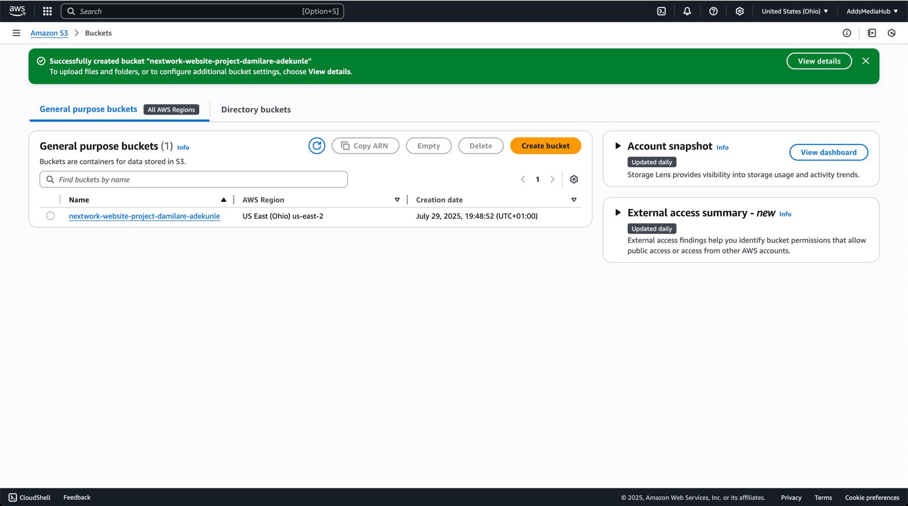
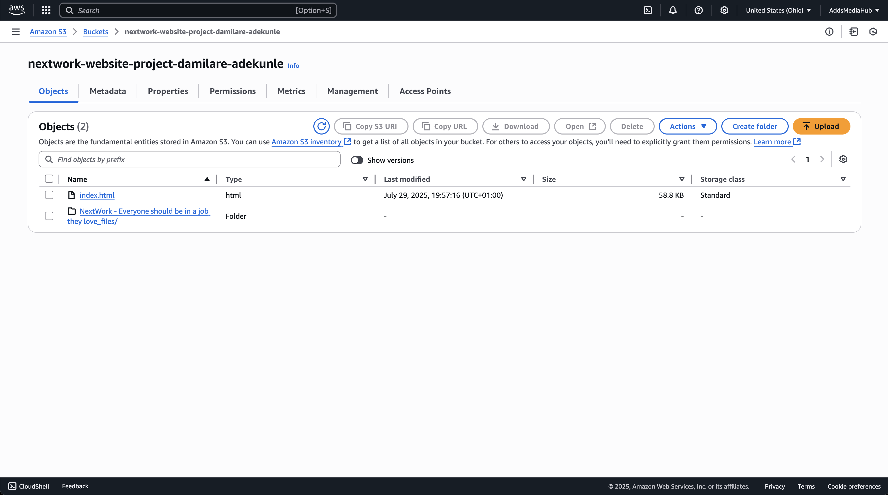
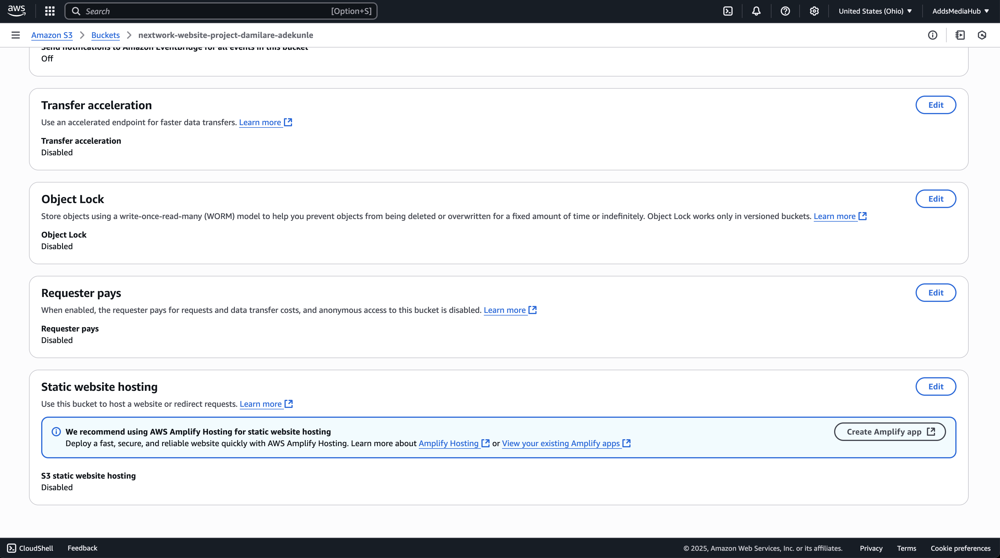
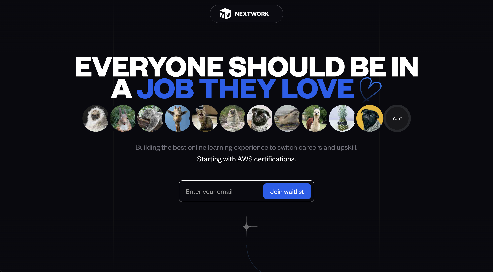

# 🪣 Hosting a Static Website on Amazon S3

This project walks through the process of deploying a **static website** using [Amazon S3](https://aws.amazon.com/s3/), a widely-used object storage service on AWS. The goal is to gain practical experience with cloud hosting, S3 bucket configurations, permission settings, and public access management.

---

## 📌 Project Overview

**Objective:**  
Host a static website using Amazon S3 by configuring a storage bucket, uploading files, setting public access policies, and enabling static website hosting.

**Why this project?**  
I completed this project to:
- Deepen my understanding of AWS services, particularly S3
- Learn how to configure permissions and policies for secure cloud deployments
- Build hands-on confidence with static website hosting in a real-world cloud environment

---

## 🛠️ Tools & Concepts

- **AWS Services Used:**  
  - Amazon S3  
  - AWS Management Console

- **Key Concepts Explored:**  
  - Static website hosting  
  - S3 buckets and object storage  
  - Access Control Lists (ACLs)  
  - Public access policies and security best practices  
  - Bucket endpoints and web accessibility  

---

## ⏱️ Time & Reflection

- **Time to complete:** ~30 minutes  
- **Biggest challenge:** Resolving the 403 Forbidden error due to misconfigured public permissions  
- **Most rewarding moment:** Seeing the site go live at the public S3 bucket URL

---

## 🪣 Step 1: Creating the S3 Bucket

Creating a bucket in S3 is the first step to hosting a static site. Each bucket name must be **globally unique**, so I chose a custom name.

- **Region selected:** `us-east-2` (Ohio) — chosen for its proximity to target users and optimal latency.
- **Permissions setup:** ACLs were **enabled** to experiment with fine-grained access control.



---

## 📁 Step 2: Uploading Website Files

I uploaded two critical components:
- `index.html` — the core HTML file for the site
- `NextWork - Everyone...love_files.zip` — includes image assets and other static files

Both files are required for proper rendering of the site.



---

## 🌍 Step 3: Enabling Static Website Hosting

S3 allows buckets to act as static web servers when enabled.

- I turned on **Static Website Hosting** in the bucket settings
- I specified `index.html` as the default root document
- This generated a **public endpoint URL** for accessing the site

Additionally:
- I chose to **enable ACLs** for object-level access control, despite AWS recommending bucket policies instead



---

## 🚫 Step 4: 403 Forbidden Error

After visiting the bucket endpoint, I initially encountered a `403 Forbidden` error.

### ✅ Root Cause:
The files were not publicly accessible. Public permissions were either missing or misconfigured.


---

## 🔐 Step 5: Fixing Permissions

To resolve the error:
- I made all uploaded files public using **object-level permissions**
- I also updated the **bucket policy** to allow anonymous users to `GET` objects

Here’s a sample policy used:

```json
{
  "Version": "2012-10-17",
  "Statement": [
    {
      "Sid": "PublicReadForStaticWebsite",
      "Effect": "Allow",
      "Principal": "*",
      "Action": "s3:GetObject",
      "Resource": "arn:aws:s3:::your-bucket-name/*"
    }
  ]
}
```

Once applied, the site became publicly accessible.

---

## ✅ Final Result

After fixing the public access configuration, I was able to view the live website at the S3 endpoint URL.



---

## 💡 Lessons Learned

- Always verify object and bucket permissions after enabling static hosting
- Enabling ACLs can give you more control, but AWS prefers policy-based access management
- S3 is a powerful tool for simple, cost-effective static website deployments

---

## 🙌 Thanks to NextWork

Special thanks to [nextwork.org](https://nextwork.org) for the guided learning experience and project inspiration. Their platform makes it easy to apply cloud concepts in real scenarios.

---

## 📎 Additional Resources

- [Amazon S3 Documentation](https://docs.aws.amazon.com/s3/index.html)
- [Hosting a Static Website on Amazon S3](https://docs.aws.amazon.com/AmazonS3/latest/userguide/WebsiteHosting.html)
- [AWS Free Tier](https://aws.amazon.com/free/)

