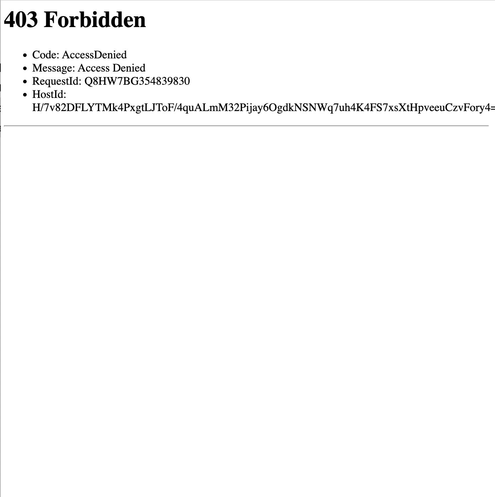

# 🪣 Host a Static Website on Amazon S3

This project demonstrates how to host a static website using **Amazon S3**. I set up a bucket, uploaded website files, and configured public access to make the site available on the internet.

---

## 📌 Project Goals

In this project, I will demonstrate how to host a static website on Amazon S3 by setting up a bucket, uploading files, and enabling public access.

I did this project to:
- Learn AWS basics
- Understand cloud storage and permissions
- Get hands-on experience with static site deployment

---

## 🛠️ Tools & Concepts

- **Services used:** Amazon S3, AWS Management Console  
- **Key concepts:**  
  - Static website hosting  
  - S3 bucket permissions  
  - Access Control Lists (ACLs)  
  - Public object access  

---

## ⏱️ Project Reflection

- **Duration:** ~30 minutes  
- **Most challenging part:** Fixing the 403 Forbidden error due to incorrect public permissions  
- **Most rewarding part:** Seeing the website live and accessible via a public URL

---

## 🪣 Step 1: Create an S3 Bucket

Creating the bucket took under 5 minutes. I selected:
- **Region:** US East (Ohio) – `us-east-2`  
  - Chosen for proximity to the target audience and lower latency  
- **Bucket name:** Must be globally unique

---

## 📂 Step 2: Upload Website Files

Files uploaded:
- `index.html` — the main webpage
- `NextWork - Everyone...love_files.zip` — images and assets

These files are required to render the full site properly.

---

## 🌐 Step 3: Enable Static Website Hosting

Website hosting means making your site publicly available online.

Actions taken:
- Enabled **Static website hosting** in S3 bucket settings
- Set `index.html` as the default homepage

I enabled **ACLs** for more granular control over object-level access.

---

## 🔗 Step 4: Access via Bucket Endpoint

Once hosting was enabled, AWS provided a **bucket endpoint URL** for public access.

### ❗ Initial Error
I encountered a `403 Forbidden` error.  
**Cause:** Files were not yet publicly accessible.

### ✅ Fix
I updated:
- Object permissions to allow public access
- Bucket policy to allow public reads

After this, the website loaded successfully!

---

## ❤️ Final Thoughts

I chose to do this project today to get practical cloud experience.  
Something that would make learning with NextWork even better is more tips for common errors and optional challenges to deepen learning.

---

## 🔗 More Projects
Explore more at: [nextwork.org](https://nextwork.org)  
Questions? Ask in the community: [NextWork Questions Forum](https://community.nextwork.org/c/i-have-a-question?automatic_login=true)
